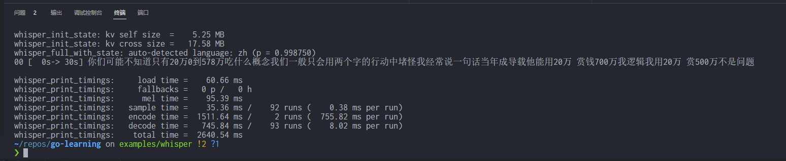

# go-whisper

go-whisper 使用[whisper.cpp](https://github.com/ggerganov/whisper.cpp)将语音转为文本.



### Requirement

- [go](https://go.dev/dl/)
- [ffmpeg](https://ffmpeg.org/download.html)

### Build

```shell
git clone https://github.com/saltfishpr/go-learning.git --branch examples/whisper
cd go-learning
```

Linux:

```shell
LIB_FOLDER="$(pwd)/lib/$(uname -s)-$(uname -m)" && C_INCLUDE_PATH=$LIB_FOLDER LIBRARY_PATH=$LIB_FOLDER go build -o go-whisper
```

Windows:

TODO

### Usage

```shell
./go-whisper samples/lbw.wav
```
