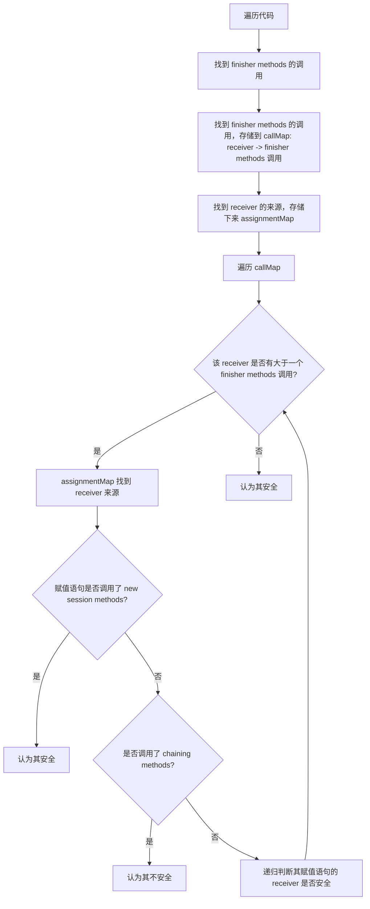

# GORM Linter

请编写一个 Go 语言的静态分析工具 gormlinter，用于检测代码库中 `gorm.DB` 的不安全链式调用。这些不安全调用可能会导致 SQL 条件污染，从而引发逻辑错误或潜在的安全风险。  

### 技术要求

- **使用 `go/ast` 或 `golang.org/x/tools/go/analysis` 进行代码解析**  
- **使用 `golang.org/x/tools/go/ssa` 分析追踪 *gorm.DB 类型的变量**  
- **生成静态分析报告，标明代码行号和潜在问题**  
- **提供自动修复建议，输出格式符合 `golangci-lint` 规范**  

### 分析逻辑

对于以下代码，分析步骤为

```go
// Bad case
func f4(db *gorm.DB) {
	tx := db.Where("name = ?", "jinzhu")

	tx.Where("age = ?", 18).Find(&users)

	tx.Where("age = ?", 28).Find(&users)
}
```

1. 遍历代码
   - 找到 finisher methods 的调用 `tx.Where("age = ?", 18).Find(&users)`，找到调用方法的 receiver `tx`。存储到 callMap: receiver -> finisher methods 调用。这里是 `tx` -> `tx.Where("age = ?", 18).Find(&users)`
   - 找到 receiver 的来源 `tx := db.Where("name = ?", "jinzhu")`，将其存储下来 assignmentMap tx -> db.Where("name = ?", "jinzhu")

2. 遍历 callMap
   - 如果该 receiver 只有一个 finisher methods 调用，则认为其安全
   - 如果该 receiver 有大于一个 finisher methods 调用，找到其来源 `tx := db.Where("name = ?", "jinzhu")`
   - 如果赋值语句调用了 new session methods，则认为其安全
   - 如果没有调用 new session methods，判断其是否调用了 chaining methods
   - 如果调用了 chaining methods，则认为其不安全
   - 如果没有调用 chaining methods，则递归判断其赋值语句的 receiver `db` 是否安全


```mermaid
graph TD
    A[遍历代码] --> B[找到 finisher methods 的调用]
    B --> C[找到 finisher methods 的调用，存储到 callMap: receiver -> finisher methods 调用]
    C --> E[找到 receiver 的来源，存储下来 assignmentMap]
    E --> F[遍历 callMap]
    F --> G{该 receiver 是否有大于一个 finisher methods 调用?}
    G -- 是 --> H[assignmentMap 找到 receiver 来源]
    G -- 否 --> I[认为其安全]
    H --> J{赋值语句是否调用了 new session methods?}
    J -- 是 --> K[认为其安全]
    J -- 否 --> L{是否调用了 chaining methods?}
    L -- 是 --> M[认为其不安全]
    L -- 否 --> N[递归判断其赋值语句的 receiver 是否安全]
    N --> G
```

#### 示例

[a.go](./testdata/src/a/a.go)
